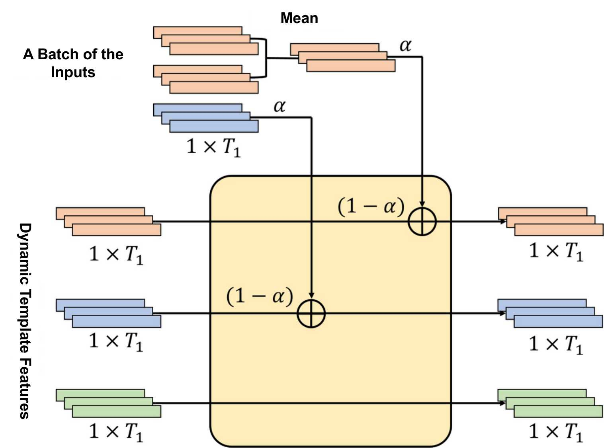

# template-networks

Code of our paper "Fixed Template Network and Dynamic Template Network: novel network designs for decoding steady-state visual evoked potentials".

## Description

This study proposed a novel network design motivated by the works of decomposition methods. Fixed Template Network (FTN) and Dynamic Template Network (DTN) are two novel networks combining the advantages of fixed templates and subject-specific templates. This study compared the intra-subject classification performance of DTN and FTN with that of state-of-the-art decomposition methods on three public SSVEP datasets.

## Datasets

Nakanishi2015, Yijun2016 and BETA were tested in this study. 

## Network Design

### Fixed Template Network

The fixed template network (FTN) was motivated by the design of eCCA that compares the data with pre-defined templates. The above figure illustrates the architecture of the FTN, considering the 3-class classification problem as an example. Three fixed templates and an input were provided to the FTN. The shape of the input was $N_c \times N_t$, where $N_c$ is the number of channels and $N_t$ is the number of time points. The shape of the template was $2N_h \times N_t$, where $N_h$ is the number of harmonics and the template is formulated as those commonly used in eCCA. All templates and input were applied with the feature extraction module, which was designed for the template and input respectively. Next, cosine similarity between the input and templates were computed along the last dimension and their return values were stacked together. A fully connected layer was finally used to classify the input label.

### Dynamic Template Network

The dynamic template network (DTN) was motivated by the design of TRCA and DSP that compares the data with subject-specific templates. The above figure illustrates the architecture of the DTN, considering the 3-class classification problem as an example. In the DTN, all templates and input were applied with the feature extraction module instead of their separate feature extraction modules in the FTN. The rest of operations were the same as those in the FTN. 

The most important part of the DTN is how to dynamically update templates based on each batch of the inputs in the training process. The below figure illustrates the template update process of the DTN, considering the 3-class classification problem as an example. The initial dynamic templates were set to zero. A batch of the inputs (two inputs colored in orange and one input colored in blue) was provided to the DTN. First, their batch templates were calculated by averaging the corresponding samples in the batch. Then, dynamic templates were updated with the exponential moving average.

## Results

The above figure is the results of dataset BETA. Here FTN-A and DTN-A means that the networks were trained with the exactly same data used in those decomposition methods.

For dataset BETA, DTN and DTN-A has the balanced accuracy as 60.1\% and 65.6\% respectively with $N_t = 0.5s$, where DTN-A has a 5.5\% improvement. In the same scenario, FTN and FTN-A has the balanced accuracy as 66.2\% and 69.4\% respectively, where FTN-A has a 3.2\% improvement. When $N_t = 1s$, DTN and DTN-A achieves the accuracy as 76.3\% and 78.5\%, with a 2.2\% increase of accuracy for DTN-A, and FTN and FTN-A achieves the accuracy as 78.3\% and 79.6\%, with an approximately 1.3\% increase of accuracy for FTN-A.

## Requirements

The code relies on my toolbox to import SSVEP datasets and other matrix decomposition methods. See [brainda](https://github.com/Mrswolf/brainda) for install instructions.

FTN and DTN implementation can be found in [model](./models.py).

Run notebook [indices](./indices.ipynb) to generate train, validate and test indices for each dataset.

Run notebook [matrix](./matrix.ipynb) to generate accuracies for matrix decomposition methods (It requires a lot of time to regenerate the results. You can skip this notebook since the results have been uploaded).

Run notebook [network](./network.ipynb) to generate accuracies for FTN and DTN.(You can skip this notebook, too)

Run notebook [results](./results.ipynb) to collect figures for this paper.

## Citation

If you find the code useful, please cite this paper:

@article{Xiao_2022,
doi = {10.1088/1741-2552/ac9861},
url = {https://dx.doi.org/10.1088/1741-2552/ac9861},
year = {2022},
month = {nov},
publisher = {IOP Publishing},
volume = {19},
number = {5},
pages = {056049},
author = {Xiaolin Xiao and Lichao Xu and Jin Yue and Baizhou Pan and Minpeng Xu and Dong Ming},
title = {Fixed template network and dynamic template network: novel network designs for decoding steady-state visual evoked potentials},
journal = {Journal of Neural Engineering}
}

## Contact

If you have any questions, please feel free to contact me.

My Email: swolfforever@gmail.com

